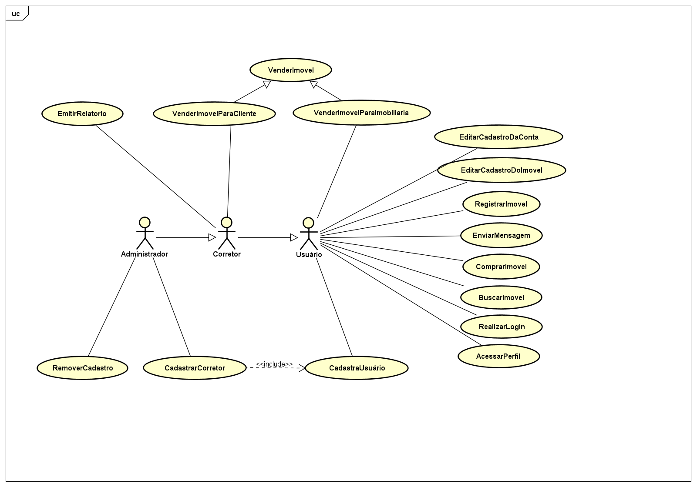

<head>

</head>

# **Diagrama de Casos de uso**

# **Descrição dos Casos de uso**
## Links
- [**UC01 - Cadastrar usuário**](#uc01---cadastrar-usuário)

- [**UC02 - Cadastrar corretor**](#uc02---cadastrar-corretor)

- [**UC03 - Realizar login**](#uc03---realizar-login)

- [**UC04 - Buscar imóvel**](#uc04---buscar-imóvel)

- [**UC05 - Fazer proposta por imóvel**](#uc05---fazer-proposta-por-imóvel)

- [**UC06 - Registrar imóvel**](#uc06---registrar-imóvel)

- [**UC07 - Vender imóvel.**](#uc07---vender-imóvel)

- [**UC08 - Enviar mensagem**](#uc08---enviar-mensagem)

- [**UC09 - Emitir relatório**](#uc09---emitir-relatório)

- [**UC10 - Remover cadastro**](#uc10---remover-cadastro)

- [**UC11 - Editar cadastro da conta**](#uc11---editar-cadastro-da-conta)

- [**UC12 - Editar cadastro do imóvel**](#uc12---editar-cadastro-do-imóvel)

- [**UC13 - Acessar perfil**](#uc13---acessar-perfil)

  

## **UC01 - Cadastrar usuário**  

**Lista de atores:** Usuário.

**Visão geral:** O usuário irá efetuar o cadastro no sistema da imobiliária.  

**Referências cruzadas:** Requisitos: RF001.  

**Pré-Condições:** Não há. 

**Pós-Condições:** O usuário é cadastrado e possui uma conta no sistema. 

**Fluxo Principal:**
1. O usuário fornece os dados requeridos. (FE01) 
2. O sistema verifica os dados do usuário. (FE02)
3. O sistema confirma o cadastro.  
4. O sistema redireciona o usuário para a tela de autenticação.
5. Caso de uso encerrado.  

**Fluxos de exceção:** 

**-FE01:** O usuário não tem conexão segura.

1. O sistema informa que a conexão do usuário não é segura.
2. Caso de uso encerrado.

**-FE02:** Dados inválidos **.**

1. O sistema informa qual(is) dado(s) está(ão) errado(s).
2. O caso de uso retorna ao passo 1 do fluxo principal.

[Links](#links)  

  

## **UC02 - Cadastrar corretor**

**Lista de atores:** Administrador.

**Visão geral:** O administrador valida o corretor no sistema.

**Referências cruzadas:** Requisitos: RF008. Casos de uso: UC01.

**Pré-Condições:** O corretor deve estar cadastrado no sistema.

**Pós-Condições:** O administrador valida com sucesso o corretor no sistema.

**Fluxo Principal:**

1. O administrador busca a conta do corretor.
2. O administrador adiciona os privilégios do corretor.
3. O sistema notifica o novo corretor informando a situação de sua conta.
4. O caso de uso é encerrado.

**Fluxo de exceção:**

**-FE01:** Conta do usuário não encontrada.

1. Sistema notifica que a conta não foi encontrada.
2. Caso de uso encerrado.

[Links](#links)  

  

## **UC03 - Realizar login**

**Lista de atores:** Usuário

**Visão geral:** O sistema faz a autenticação do usuário no sistema.

**Referências cruzadas:** Requisitos: RF002. Casos de uso: UC01.

**Pré-Condições:** O usuário deve estar cadastrado no sistema.

**Pós-Condições:** O usuário consegue acessar o sistema após realizar login

**Fluxo Principal:**

1. O usuário informa seus dados de autenticação. (FA01) (FE01)
2. O sistema faz a autenticação dos dados. (FE02)
3. O sistema confirma a autenticação do usuário.
4. O caso de uso é encerrado.

**Fluxos alternativos:**

**-FA01:** O usuário esqueceu sua senha.

1. O usuário informa o seu e-mail cadastrado.
2. O sistema notifica que enviará um e-mail ao usuário cadastrado.
3. O caso de uso retorna para o passo 1 do fluxo principal.

**Fluxos de exceção:**

**-FE01:** O usuário não tem conexão segura.

1. O sistema informa que a conexão do usuário não é segura.
2. O caso de uso retorna.

**-FE02:** Dados inválidos.

1. O sistema informa qual(is) dado(s) está(ão) errado(s).
2. O caso de uso retorna para o passo 1 do fluxo principal.

[Links](#links)  

  

## **UC04 - Buscar imóvel**

**Lista de atores:** Usuário.

**Visão geral:** O usuário faz uma busca por um imóvel no sistema.

**Referências cruzadas:** Requisitos: RF004, RF005 e RF006.

**Pré-Condições:** O usuário precisa ter realizado login.

**Pós-Condições:** O usuário deverá ser capaz de ver as ofertas que deseja do sistema.

**Fluxo Principal:**

1. O usuário pesquisa o imóvel informando o bairro. (FA01) (FE01)
2. O sistema procura os imóveis que se encaixam na busca do usuário. (FE02)
3. O sistema apresenta os imóveis que se encaixam na busca do usuário.
4. O caso de uso é encerrado.

**Fluxos alternativos:**

**-FA01:** Filtro de busca.

1. O sistema oferece a opção de filtrar as buscas.
2. O usuário escolhe a opção desejada.
3. O caso de uso retorna para o passo 2 do fluxo principal.

**Fluxos de exceção:**

**-FE01:** Bairro inexistente.

1. O sistema informa que o bairro informado não existe.
2. O caso de uso retorna para o passo 1 do fluxo principal.

**-FE02:** Não possui imóveis com as características de busca.

1. O sistema informa que não há imóveis disponíveis com aquele perfil de pesquisa.
2. O caso de uso retorna para o passo 1 do fluxo principal.

[Links](#links)  

  

## **UC05 - Fazer proposta por imóvel**

**Lista de atores:** Usuário.

**Visão geral:** Permite que o usuário demonstre seu interesse pelo imóvel e contate o responsável pelo mesmo.

**Referências cruzadas:** Requisitos: RF004 e RF010. Casos de uso: UC04.

**Pré-Condições:** O usuário precisa ter realizado login e escolher o imóvel desejado.

**Pós-Condições:** O usuário prossegue a negociação com o corretor.

**Fluxo Principal:**

1. O usuário seleciona o imóvel.
2. O sistema exibe as informações do imóvel.
3. O usuário confirma o interesse pelo imóvel. (FA01)
4. O sistema apresenta os campos para o preenchimento da proposta.
5. O usuário preenche os campos. 
6. O sistema informa ao corretor responsável o interesse sobre o imóvel.
7. O sistema redireciona o usuário para o chat com o corretor responsável.
8. O caso de uso é encerrado.

**Fluxos de exceção:**

**-FE01:** Proposta inválida.

1. O sistema informa que a proposta não é válida.
2. Caso de uso retorna para o passo 4 do fluxo principal.

[Links](#links)  

  

## **UC06 - Registrar imóvel**

**Lista de atores:** Usuário.

**Visão geral:** O usuário faz o registro de um imóvel no sistema para vender.

**Referências cruzadas:** Requisitos: RF011. Casos de uso: UC07 e UC08.

**Pré-Condições:** O usuário precisa ter realizado login.

**Pós-Condições:** O imóvel é registrado no sistema.

**Fluxo Principal:**

1. O sistema apresenta o formulário de cadastro.
2. O usuário preenche o formulário requisitado.
3. O sistema verifica os dados informados. (FE01)
4. O sistema confirma o estado do registro.
5. O caso de uso é encerrado.

**Fluxos de exceção:**

**-FE01:** Dados inválidos.

1. O sistema informa qual(is) dado(s) está(ão) errado(s).
2. O caso de uso retorna para o passo 2 do fluxo principal.

[Links](#links)  

  

## **UC07 - Vender imóvel.**

**Lista de atores:** Usuário.

**Visão geral:** O usuário irá oferecer a proposta de venda do seu imóvel.

**Referências cruzadas:** Requisitos: RF003 e RF009. Casos de uso: UC06.

**Pré-Condições:** O usuário deve estar autenticado no sistema e deve ter registrado seu imóvel.

**Pós-Condições:** A proposta do usuário é enviada à imobiliária ou a proposta do corretor é enviada aos usuários.

**Fluxo Principal:**

1. O usuário seleciona qual dos seus imóveis irá vender para a imobiliária. (FA01)
2. O usuário informa a proposta sobre o imóvel.
3. O sistema confirma a proposta. (FE01)
4. O sistema adiciona a proposta em sua lista de vendas para a imobiliária.
5. O sistema envia notificação para os corretores.
6. Caso de uso encerrado.

**Fluxos alternativos:**

**-FA01:** Vender imóvel para clientes.

1. O corretor escolhe qual imóvel da imobiliária irá vender
2. O usuário informa a proposta sobre o imóvel.
3. O sistema confirma a proposta.
4. O sistema adiciona em sua lista de vendas para os clientes.
5. Caso de uso encerrado.

**Fluxos de exceção:**

**-FE01:** Proposta inválida.

1. O sistema informa que a proposta não foi informada da maneira correta.
2. O sistema exibe a maneira correta de enviar a proposta.
3. O caso de uso retorna ao passo 2 do fluxo principal.

[Links](#links)  

  

## **UC08 - Enviar mensagem**

**Lista de atores:** Usuário.

**Visão geral:** Irá permitir uma comunicação entre o usuário e o corretor, a fim de melhorar a experiência da compra ou venda do imóvel.

**Referências cruzadas:** Requisitos: RF007. Casos de uso: UC05 e UC07.

**Pré-Condições:** O usuário precisa ter realizado login.

**Pós-Condições:** O usuário terá se comunicado com o destinatário.

**Fluxo Principal:**
1. O usuário escolhe a pessoa que deseja enviar a mensagem.
2. O usuário digita o texto para o destinatário. (FA01) (FE01)
3. O sistema confirma que a mensagem foi enviada.
4. O sistema informa o status da mensagem.
5. O caso de uso é encerrado.

**Fluxos alternativos:**

**-FA01:** O usuário escolhe mandar uma mensagem por áudio.
1. O usuário seleciona a opção de enviar áudio.
2. O usuário grava o áudio a ser enviado.
3. O caso de uso retorna para o passo 3 do fluxo principal.

**Fluxos de exceção:**

**-FE01:** O usuário digita palavras ofensivas.
1. O sistema oculta a palavra ofensiva.
2. O caso de uso retorna para o passo 3 do fluxo principal.

[Links](#links)  

  

## **UC09 - Emitir relatório**

**Lista de atores:** Corretor e administrador.

**Visão geral:** O sistema irá fornecer relatórios com as informações específicas requisitadas.

**Referências cruzadas:** Requisitos: RF016, RF017, RF018, RF019 e RF020.

**Pré-Condições:** O corretor deve estar autenticado no sistema.

**Pós-Condições:** O relatório é emitido com sucesso.

**Fluxo Principal:**
1. O corretor seleciona o relatório que deseja.
2. O sistema pede o CPF do corretor para busca no sistema. (FA01)
3. O sistema verifica o CPF do corretor. (FE01)
4. O sistema faz a confirmação.
5. O sistema fornece o relatório.
6. O sistema informa que o relatório foi emitido com sucesso.
7. Caso de uso encerrado.

**Fluxos alternativos:**

**-FA01:** O corretor não tem o CPF em mãos.

1. O sistema pede a matrícula do corretor na empresa.
2. O sistema verifica a matrícula do corretor.
3. O caso de uso retorna para o passo 4 do fluxo principal.

**Fluxos de exceção:**

**-FE01:** CPF inválido.

1. O sistema informa que a matrícula do corretor é inválida.
2. O caso de uso retorna ao passo 2 do fluxo principal.

[Links](#links)  

  

## **UC10 - Remover cadastro**

**Lista de atores:** Administrador.

**Visão geral:** O sistema permitirá que o administrador remova o cadastro do usuário ou apenas os privilégios do corretor.

**Referências cruzadas:** Requisitos: RF014 e RF015.

**Pré-Condições:** O corretor deve estar autenticado no sistema.

**Pós-Condições:** Conta removida ou privilégios de corretor removidos.

**Fluxo Principal:**
1. O administrador busca o usuário.
2. O administrador solicita a remoção do cadastro de um usuário ou o privilégio de corretor da conta.
3. O sistema pede a confirmação.
4. O administrador confirma a ação.
5. O sistema remove o cadastro de um usuário ou privilégio de corretor da conta.
6. O sistema notifica o usuário sobre a situação de sua conta.
7. Caso de uso encerrado.

**Fluxos alternativos:**

**-FA01:** O administrador não confirma a ação.
1. O sistema cancela a ação.
2. Caso de uso encerrado.

**Fluxos de exceção:**

**-FE01:** Usuário não encontrado.
1. O sistema notifica que o usuário buscado é inválido e/ou não existe.
2. O caso de uso retorna ao passo 1 do fluxo principal.

[Links](#links)  

  

## **UC11 - Editar cadastro da conta**

**Lista de atores:** Usuário.

**Visão geral:** O sistema permitirá que o usuário faça alterações em suas informações do perfil.

**Referências cruzadas:** Requisitos: RF012.

**Pré-Condições:** O usuário deve estar autenticado no sistema.

**Pós-Condições:** Dados editados com sucesso.

**Fluxo Principal:**

1. O usuário acessa suas informações.
2. O usuário solicita edição de um campo.
3. O usuário preenche a nova informação.
4. O sistema pede a confirmação.
5. O usuário confirma a ação.
6. Caso de uso encerrado

**Fluxos alternativos:**

**-FA01:** O usuário não confirma a ação.

1. O sistema cancela a ação.
2. Caso de uso encerrado

**Fluxos de exceção:**

**-FE01:** Dado com formatação inadequada.

1. O sistema notifica o dado inválido.
2. O caso de uso retorna ao passo 3 do fluxo principal.

[Links](#links)  

  

## **UC12 - Editar cadastro do imóvel**

**Lista de atores:** Usuário.

**Visão geral:** O sistema permitirá que o usuário faça alterações em suas informações dos imóveis.

**Referências cruzadas:** Requisitos: RF013.

**Pré-Condições:** O usuário deve estar autenticado no sistema.

**Pós-Condições:** Dados editados com sucesso.

**Fluxo Principal:**

1. O usuário acessa seus imóveis.
2. O usuário escolhe o imóvel que deseja alterar.
3. O usuário solicita edição de um campo.
4. O usuário preenche a nova informação.
5. O sistema pede a confirmação.
6. O usuário confirma a ação.
7. Caso de uso encerrado.

**Fluxos alternativos:**

**-FA01:** O usuário não confirma a ação.

1. O sistema cancela a ação.
2. Caso de uso encerrado

**Fluxos de exceção:**

**-FE01:** Dado com formatação inadequada.

1. O sistema notifica o dado inválido.
2. O caso de uso retorna ao passo 3 do fluxo principal.

[Links](#links)  

  

## **UC13 - Acessar perfil**

**Lista de atores:** Usuário.

**Visão geral:** O sistema permitirá que o usuário acesse o perfil de um usuário verificando suas informações.

**Referências cruzadas:** Requisitos: RF021.

**Pré-Condições:** O usuário deve estar autenticado no sistema.

**Pós-Condições:** Página de perfil acessada.

**Fluxo Principal:**

1. O usuário solicita o acesso ao perfil.
2. O sistema redireciona o usuário para o perfil.
3. Caso de uso encerrado.

[Links](#links)  
