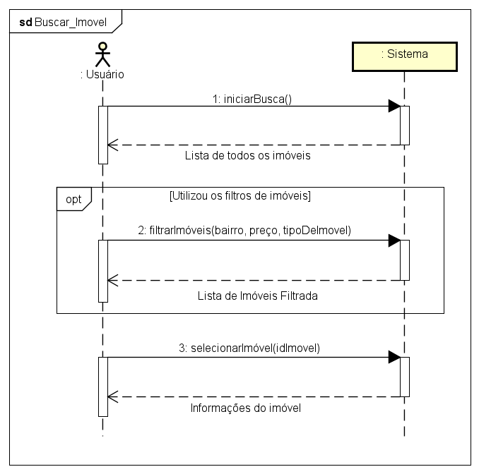
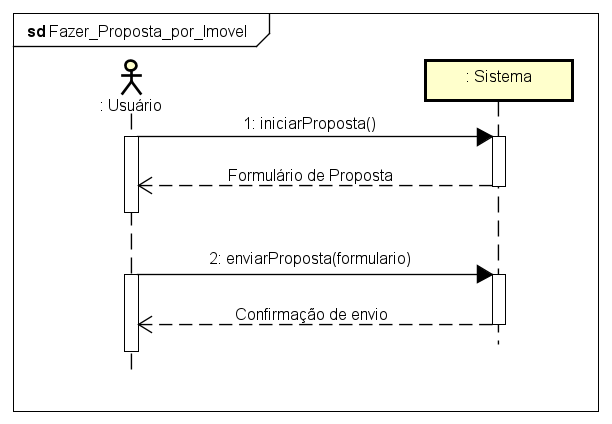

# **Contratos**

## **UC04 - Buscar imóvel**

 

 

### **Operação:** iniciarBusca() 

**Responsabilidade:** Usuário inicia o processo de busca e o sistema apresenta a lista com todos os imóveis.

**Referências cruzadas:** Caso de Uso: "UC04 - Buscar imóvel".

**Pré-Condições:** 
- Existir pelo menos um imóvel na lista de imóveis.

**Pós-Condições:** 
- Sistema apresenta a lista de imóveis para o usuário.

   

### **Operação:** filtrarImóveis(bairro, preço, tipoDeImovel)

**Responsabilidade:** Usuário filtra os imóveis da lista de acordo com as suas preferências em bairro, preço e tipo de imóvel.

**Referências cruzadas:** Caso de Uso: "UC04 - Buscar imóvel". Regra de Negócio : "RN02"

**Pré-Condições:** 
- Lista de imóveis apresentada.

**Pós-Condições:** 
- Imóveis filtrados da lista são apresentados para o usuário.

   

### **Operação:** selecionarImovel(idImovel)

**Responsabilidade:** Selecionar o imóvel que o usuário deseja.

**Referências cruzadas:** Caso de Uso: "UC04 - Buscar Imóvel".

**Pré-Condições:** 
- Ter algum imóvel para ser selecionado.
- Usuário escolheu o imóvel.

**Pós-Condições:** 
- Informações do imóvel exibidas para o usuário.

   

## **UC05 - Fazer Proposta por Imóvel**

 

 

### **Operação:** apresentarFormulárioDeProposta()  

**Responsabilidade:** Mostrar o formulário da proposta para ser preenchido pelo usuário.

**Referências cruzadas:** Caso de Uso: "UC05 - Fazer proposta por imóvel".

**Pré-Condições:** 
- Imóvel selecionado.
- Formulário de proposta definido.

**Pós-Condições:** 
- Formulário é preenchido.
- Proposta criada.
- Proposta vinculada ao imóvel selecionado.

   

### **Operação:** enviarProposta() 

**Responsabilidade:** Enviar proposta do usuário ao corretor responsável pelo imóvel selecionado.

**Referências cruzadas:** Caso de Uso: "UC05 - Fazer proposta por imóvel".

**Pré-Condições:** 
- Proposta realizada.
- Imóvel vinculado a um corretor

**Pós-Condições:** 
- Corretor recebe a proposta.

   

### **Operação:** confirmaPropostaEnviada()

**Responsabilidade:** Confirmar com o usuário que a proposta foi enviada ao corretor.

**Referências cruzadas:** Caso de Uso: "UC05 - Fazer proposta por imóvel".

**Pré-Condições:** 
- Proposta enviada para o corretor.

**Pós-Condições:** 
- Cliente avisado que a proposta ja foi enviada.
- Finalizar processo de realização de proposta.

  

### _[Voltar para a tela inicial do repositório](/)_
