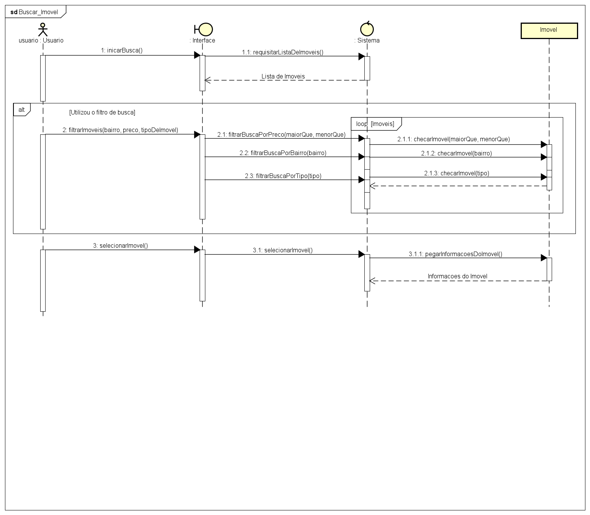
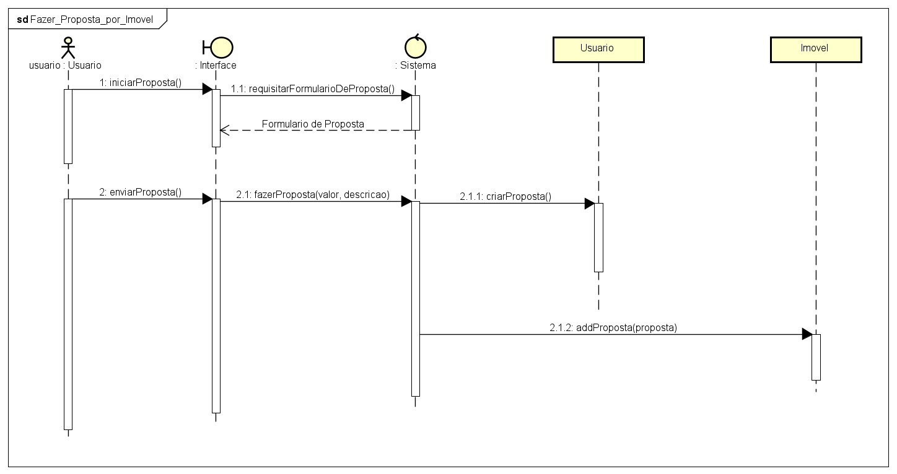
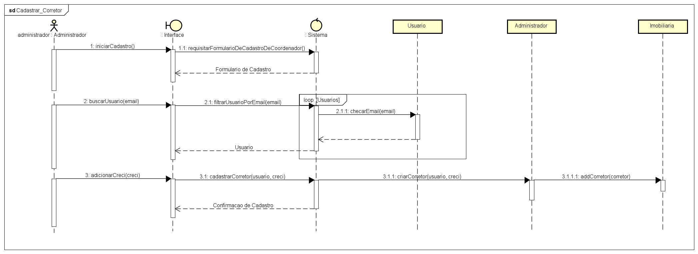

# Diagrama de Sequência de Projeto
## 1. Buscar Imóvel

## 2. Fazer Proposta por Imóvel

## 3. Cadastrar Corretor

### _[Voltar para a tela inicial do repositório](https://github.com/Sergiorezende22/QuickSell)_